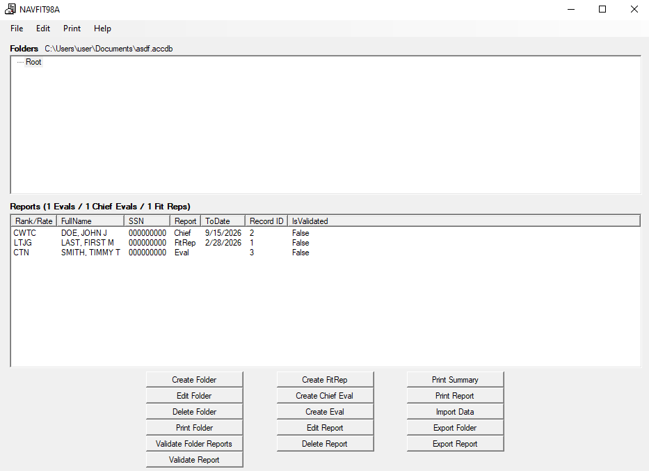

# NAVFITX

NAVFITX is an next-gen NAVFIT application built to supercede NAVFIT98A.

## Background

- Every year, every service member in the Navy creates a performance evalution report.
- Each report is a single, two-sided document. The only method to submit a report was, and still is, to physically mail it to NAVPERSCOM.[^2]
- NAVFIT98A was released in 1998. It was/is a Windows GUI application written in Visual Basic that allows users to electronically create an edit reports.
- Many years passed, and NAVFIT98A did not receive any major update. After [two decades](https://blog.usni.org/posts/2018/10/11/happy-anniversary-navfit98) of use, there were widespread calls for modernization.
- In 2022, the Navy released eNavFit, which was "designed to be a bridge to future performance evaluation modernization".[^3]
- When Navy ships and stations tried to use eNavFit, they encountered so many bugs and issues that in November 2023, the Navy released [NAVADMIN 279/23](https://navadmin-viewer.fly.dev/NAVADMIN/279/23), which stated that NAVFIT98A would continue to be available through the end of 2025 while problems with eNavFit were fixed.
- In January 2025, [NAVADMIN 012/25](https://www.mynavyhr.navy.mil/Portals/55/Messages/NAVADMIN/NAV2025/NAV25012.pdf?ver=XNxecwkcKmyF0dFjhYHpzA%3d%3d) was released, stating that eNavFit would officially be scrapped and no longer available for use starting 1 May 2025. Furthermore, it anounced a "modernized and more capable NAVFIT98A" update to be released that month, providing service members with a more "user-friendly" experience, along with "updated business rules that will significantly reduce the number of rejected reports received by Navy Personnel Command".[^4]

## Current State of NAVFIT98A

When [NAVADMIN 012/25](https://www.mynavyhr.navy.mil/Portals/55/Messages/NAVADMIN/NAV2025/NAV25012.pdf?ver=XNxecwkcKmyF0dFjhYHpzA%3d%3d) was released in Jan 2025, the new version 32 update had not yet been released. As of this writing (Oct 2025), NAVFIT98A is now on version 33, and the Navy has not anounced any plans to move away from NAVFIT98A going forward.

Did version 32 fix the problems with NAVFIT98A? Did it make it more modern and user-friendly?

**Does NAVFIT98A meet the needs of the Navy?**

<figure style="width: 700px; text-align: center;">
  <picture>
    
  </picture>
  <figcaption>NAVFIT98A Version 33; up-to-date as of this writing in October 2025</figcaption>
</figure>

It's hard to argue that the current NAVFIT98A v33 has effectively been "modernized"; its software is so antiquated that its intallation triggers Microsoft Defender Antivirus alerts.

The need for a platform that can easily facilitate the creation, revision, validation, and submission of performance evaluations is a real one. The Navy recognized this fact when it attempted to roll out eNavFit.

eNavFit came and went, and now we're back to NAVFIT98A. The most recent update did offer minor improvements:

- It did provide a validation feature. Users can click a button which produces an ASCII report detailing problems the program has found with information entered into a performance evaluation. Though primitive, this validation is mostly functional.
- Supposedly, the 64-bit version of the app has a more seamless install on more modern Windows operating systems (I have not tested this).

But the same problems remain:

- It's very buggy. It's prone to crashing, or throwing errors with unhelpful error messages that do not make it clear what went wrong.
- bad output formats
- poor user guide / installation instructions
- What you see is not what you get
- It isn't simple to install. 
- validation could be improved even more
- not backward compatible; not all .accdb files created by NAVFIT98A can be opened by all other versions.
- not extensible

<!-- ## The Way Forward -->

<!-- These  mailed to the Performance Evaluation Branch, which receives 500k-600k 
- NAVFIT98A is Windows platform desktop application written in Visual Basic in 1998.
- It's purpose is to generate PDF performance evaluation reports. Every service member in the Navy gets a performance eval annually. -->

<!-- [^]: https://seastoriesandotherlies.org/2020/08/11/eval-writing-part-ii-navfits-revenge/?utm_source=chatgpt.com "Eval Writing Part II: NAVFIT's Revenge" -->

## Helpful Links

(The Navy likes to change links on their web pages often - please let me know if one is broken.)

- [NAVFIT98A v30 User Guide Manual](https://www.mynavyhr.navy.mil/Portals/55/Career/PerformanceEvaluation/NAVFIT98A%20Version%2030%20user%20guide.pdf?ver=rBFhxjABpJhUybBeMo6AMA%3d%3d)

- [Performance Evaluation Links](https://www.mn3p.navy.mil/web/performance/overview)

[^1]: Even in 2025, evaluation reports are still submitted on physical paper via snailmail to Navy Personnel Command; [Performance Evaluation Reports Frequently Asked Questions August 2025](https://www.mn3p.navy.mil/documents/d/performance/navfit98a-v2-2-0-33-frequently-asked-question?download=true) states: "Presently, there is no electronic system to submit performance evaluation reports. Per BUPERSINST 1610.10H, chapter 1, paragraph 1-5, All reports must be mailed within 15 days of the ending date (block 15) for active-duty members and within 30 days for INACT members."
[^2]: [BUPERSINT 1610.10H](https://www.mynavyhr.navy.mil/Portals/55/Reference/Instructions/BUPERS/BUPERSINST%201610.10.pdf?ver=DZVcHnNH8gLkDjKjDFyaKA%3d%3d)
[^3]: [NAVADMIN 279/23](https://navadmin-viewer.fly.dev/NAVADMIN/279/23) - Permitted NAVFIT98A to be used through the end of 2025 due to issues with eNavFit.
[^4]: [NAVADMIN 012/25](https://www.mynavyhr.navy.mil/Portals/55/Messages/NAVADMIN/NAV2025/NAV25012.pdf?ver=XNxecwkcKmyF0dFjhYHpzA%3d%3d) - Announced eNavFit would be scrapped, and NAVFIT98A version 32 release.