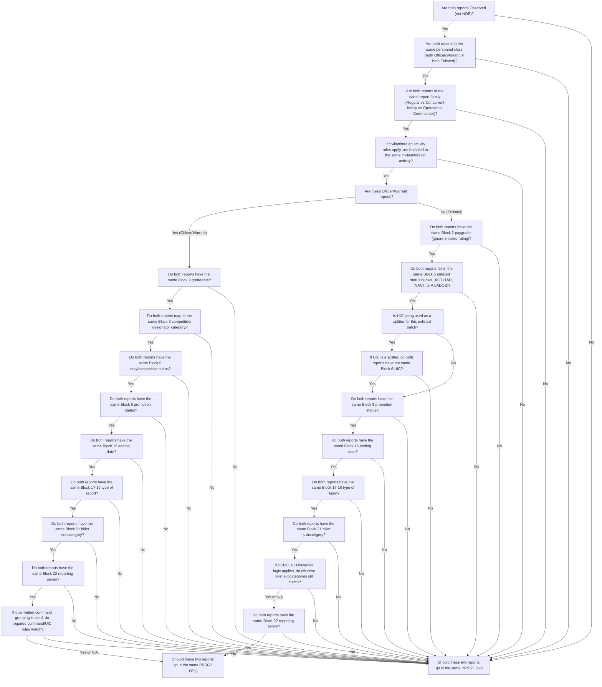

# Summary Groups

## What are Summary Groups? 

Enlisted summary groups generally consist of all Service members in the same paygrade (regardless of rating) and same promotion status who receive the same type of report from the same reporting senior, on the same ending date. The unit identification code is also a breakout for enlisted summary groups. Officer summary groups are similar but are further subdivided by competitive category (unrestricted line officers, limited duty officers (LDO), each designator within the restricted line, and each designator within the Staff Corps). Certain other criteria also apply, as detailed in the EVALMAN, chapter 1, instructions for the summary group block. Each group of reports must be mailed to PERS-32 with a summary letter marked “Controlled Unclassified Information,” which includes the names, SSNs or DoD identifications (ID), member trait averages, summary group average, and distribution of promotion recommendations for that group. It is mandatory to verify or handwrite the reporting senior’s e-mail address and telephone number on the bottom of the summary letter in the blocks provided. If there is an error on a report in a batch, it will help PERS-32 to expedite corrections.

## Officers

??? info "Officer Summary Groups Table (W-1 through O-6)"

    | Block | Block Label | Remarks (Group officer reports that share **all** the following characteristics.) | 
    |:-----:|-------------|---------|
    | 2 | Grade/Rate | Group by grade worn on report ending date. | 
    | 3 | Designator | Group by competitive designator category (see below). | 
    | 5 | Duty/Competitive Status | Group by box marked in Block |
    | 8 | Promotion Status | Group by promotion status. |
    | 15 | To | Group by ending date of report. |
    | 17-19 | Type of Report | Group by type of report. |
    | 21 | Billet Subcategory | Group by entry in this block.|
    | 22 | Reporting Senior | Group by reporting senior. "Dual- hatted" commanders may group by command, if block 26 displays a separate UIC for each command. On Dual- hatted reports, blocks 6 and 26 must match. Dual- hatted defines a flag officer specifically identified in OPNAVINST 5400.45A Standard Naval Distribution List (SNDL) with two or more separate organizations as opposed to having one command with multiple UICs. |
    | 42 | Promotion Recommendation | Must have Observed promotion recommendation.  Do not include NOB promotion recommendations in a summary group. |

### Officer Competitive Categories

Convert block 3 entry into competitive designator categories as detailed below. Each category consists of all designators within the parentheses. Where a category consists of more than one designator, that block on the summary letter is left blank. Do not use this code on the report itself. Note: Active, TAR, and INACT officers are separated in different summary groups by the entry in block 5.

[Manual of Navy Officer Manpower and Personnel Classifications](https://www.mynavyhr.navy.mil/References/NOOCS-Manual/NOOCS-VOL-1/), Part A contains the official list of officer designator codes.

??? info "Unrestricted Line (URL)"

    - URL 11xx/13xx/19xx

??? info "Restricted Line"

    - Special Duty (Human Resources) (12xx)
    - Special Duty (Permanent Military Professor) (123X)
    - Special Duty (Permanent Professional Recruiter) (128x)
    - Engineering Duty (14xx)
    - Aerospace Engineering Duty (150x)
    - Aerospace Engineering Duty (Engineering) (151x)
    - Aerospace Engineering Duty (Maintenance) (152x)
    - Aviation Duty (154x)
    - Special Duty (Public Affairs) (165x)
    - Special Duty (Strategic Sealift) (166x)
    - Special Duty (Recruiter) (168x)
    - Special Duty (Foreign Area) (17xx)

??? info "Information Warfare Line"

    - Information Warfare Oceanography (1800)
    - Information Warfare Cryptologic Warfare (1810)
    - Information Warfare Information Professional (1820)
    - Information Warfare Intelligence (1830)
    - Information Warfare Cyber Warfare Engineer (1840)
    - Information Warfare Maritime Space (1870)
    - Information Warfare Maritime Cyber Warfare (1880)

??? info "Staff"

    - Medical Corps (210x) Dental Corps (220x)
    - Medical Service Corps (230x)
    - Judge Advocate General's Corps (250x)
    - Senior Health Care Executive (270x)
    - Nurse Corps (290x)
    - Supply Corps (310x) Chaplain Corps (410x)
    - Civil Engineer Corps (510x)

??? info "Reserve Limited Duty Officer/Warrant Officer"

    - Officer (Line) (61xx/62xx/63xx/64xx)
    - Limited Duty Officer (Staff) (65xx)
    - Chief Warrant Officer (all 7xxx)

??? info "Active Limited Duty Officer"

    - Surface (61xx)
    - Submarine/Nuclear (62xx)
    - Aviation (63xx)
    - General Line (64xx)
    - Civil Engineer (653x)
    - Supply (651x)
    - Information Warfare (68xx)

??? info "Active Chief Warrant Officer"

    - Surface (71xx)
    - Submarine/Nuclear (72xx/740x) Aviation (73xx)
    - General Line (74xx)
    - General Staff (75xx)
    - Unmanned Aerial Vehicle (UAV) (7371)
    - Information Warfare Community (78xx)

## Enlisted

??? info "Enlisted Summary Groups Table (E-1 through E-9)"

    | Block | Block Label | Remarks (Group enlisted reports that share all the following characteristics.)|
    |:-----:|-------|----------------------------------------------------------------------------------------|
    | 2 | Rate | Group by current paygrade, regardless of rating. |
    | 5 | Duty/Competitive Status | For enlisted, group ACT and TAR together, group INACT, AT/ADOS separately.
    | 6 | UIC | If reporting seniors have more than one UIC, but desire to group all enlisted personnel together, they may do so. If multiple summary groups, Block 6 should match the primary UIC of the reporting senior in block 26. |
    | 8 | Promotion Status | Group by promotion status. |
    | 15 | To | Group by ending date of report. |
    | 17-18 | Type of Report | Group by type of report. |
    | 21 | Billet | Group by entry in this block. |
    | 22 | Reporting Senior | Group by reporting senior. |
    | 45EV 48CE | Promotion Recommendation | Must have Observed promotion recommendation. Do not include NOB promotion recommendations in a summary group. |

## Summary Group Flowchart

