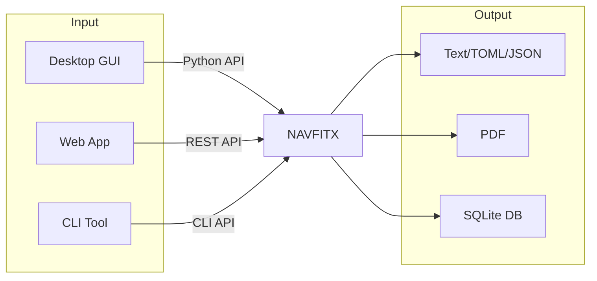

# Why?

**Why build NAVFITX?**

Since 1998, the Navy has been using an Visual Basic app called NAVFIT98 to create performance evaluation reports for all its service members. 

It's slow, buggy, and only exports reports as PDFs.

The slowness and bugs could be overlooked, but the ability to only export as a PDF is very constraining. Due to this limitation, the only method to submit reports to the Navy Personnel Command is to *physically mail it* (often taking much longer than typical mail since many reports originate from a ship or submarine).

The downstream effect of handling reports as physical PDFs is significant:

- When reports arrive to NAVPERSCOM, they are **manually** validated
- After validation, these reports are **manually** scanned and uploaded into a service member's Official Military Personnel File (OMPF)
- If a report is invalid (which happens often), the report must be redone and resubmitted by the originating command, resulting in significant delays because the new report must be physically mailed

But efficiency aside, there's a larger problem: since the from service members' reports is not queryable, there is no current method for analyzing past to draw conclusions about the effectiveness of the Navy's Performance Evaluation system.[^1]

## eNavFit

In November 2021, the [NAVADMIN 267/21](https://www.mynavyhr.navy.mil/Portals/55/Messages/NAVADMIN/NAV2021/NAV21267.txt?ver=1m0Z1uYm9eRwZT2jHTVQLw%3D%3D) was realeased. It recognized the shortcomings of NAVFIT98 in its opening paragraph:

> “Dominance of the maritime domain requires innovation and forward thinking. With investments in platforms, weapons and technologies to meet evolving operational conditions, it is imperative that we invest in our most essential warfighting asset, our people. Talent management and modern development approaches are required to attract, develop, train and retain the best and fully qualified Sailors in our Navy.”

It then anounced eNavFit: a web-app intended to replace NAVFIT98.

The motivation behind creating eNavFit was good, but ultimately it failed to get implemented in the fleet.

### Timeline

- NOV2021: [NAVADMIN 267/21](https://www.mynavyhr.navy.mil/Portals/55/Messages/NAVADMIN/NAV2021/NAV21267.txt?ver=1m0Z1uYm9eRwZT2jHTVQLw%3D%3D) announces eNavFit, a program intended to address the deficiencies with NAVFIT98
- JAN2022: [NAVADMIN 004/22](https://www.mynavyhr.navy.mil/Portals/55/Messages/NAVADMIN/NAV2022/NAV22004.txt?ver=VHggr8Z2gf5-0-iI2Vo1dg%3D%3D) announces plans to sunset NAVFIT98 in late FY 2022
- FEB2022: eNavFit goes online
- NOV2022: [NAVADMIN 250/22](https://www.mynavyhr.navy.mil/Portals/55/Messages/NAVADMIN/NAV2022/NAV22250.txt?ver=ajI0gm_W8wNT4xP0XTw9Vg%3D%3D) acknowledges issues and bugs with eNavFit and pushes NAVFIT98 sunset date back to DEC2023
- NOV2023: [NAVADMIN 279/23](https://www.mynavyhr.navy.mil/Portals/55/Messages/NAVADMIN/NAV2023/NAV23279.txt?ver=RmNweMI-Qj899te0YFkGZA%3D%3D) acknowledges continued issues with eNavFit, pushing NAVFIT98 sunset date back to DEC2025
- JAN2025: [NAVADMIN 012/25](https://www.mynavyhr.navy.mil/Portals/55/Messages/NAVADMIN/NAV2025/NAV25012.pdf?ver=XNxecwkcKmyF0dFjhYHpzA%3D%3D) recognizes the failure of eNavFit, and mandates that NAVFIT98 return to fleet wide use beginning MAY2025
- MAY2025: eNavFit goes offline

### What went wrong?

- **Poor offline functionality.** eNavFit didn't work well when it wasn't interent connected. This made is a non-starter for many users at sea.
- **Lack of Training.** Sailors reported that eNavFit was unnecessarily complicated and they didn’t receive adequate training to use it.
- **Poor Feedback Loops.** Sailors did not have a good mechanism for giving feed back on eNavFit deficiencies, and updates to fix bugs were very slow to be released.

## The Way Forward

To avoid the issues faced by eNavFit, a next generation NAVFIT app should have the following features:

- **Offline Capability.** This is non-negotionable.
    - NAVFITX works great offline!
- **Intuitive to Use.** It shouldn't be necessary to receive training just to create a peformance evaluation report. The user experience should be intuitive and easy to use.
    - NAVFITX purposefully mimics the NAVFIT98A graphic user interface (GUI) so that NAVFIT98 users will find its use and intuitive.
- **Short Feedback Loop.** eNavFit didn't have a good mechanism for users to submit feedback, resulting in bugs that were evident to users but not always the developers. The next NAVFIT app should provide users and accessible way to let developers know about issues so that patches and updates can be rolled out quickly.
    - NAVFITX is open source. Any user can [submit issues](https://github.com/tristan-white/navfitx/issues) to the project, or even submit code to fix/add features.

## Further Reading

- [Successful Practices for Employee Performance Evaluations](https://apps.dtic.mil/sti/citations/AD1114373)
- [Improving the Navy’s Performance Evaluation System with Successful Practices](https://dair.nps.edu/handle/123456789/4730)
- [Military Officer Performance: Actions Needed to Fully Incorporate Performance Evaluation Key Practices](https://www.gao.gov/assets/gao-25-106618.pdf)

[^1]: This problem is summarized well by Laura Small from the Naval Postgraduate School in her thesis [*Successful Practices for Employee Performance Evaluations*](https://apps.dtic.mil/sti/citations/AD1114373); see section III.D: "FINDINGS: CURRENT PES SHORTCOMINGS".